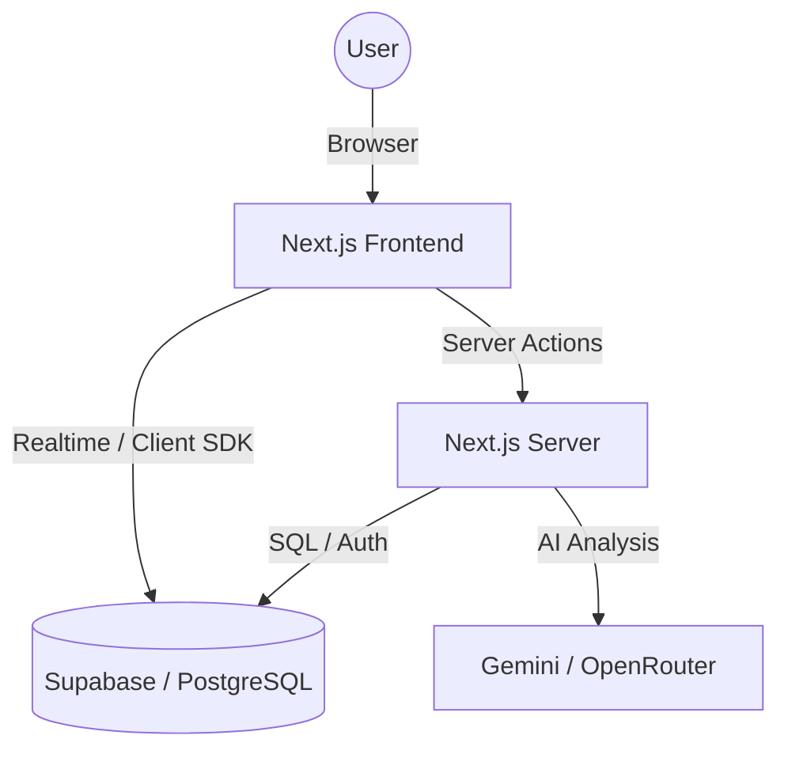

# System Architecture

Dokumen ini menjelaskan arsitektur teknis, tumpukan teknologi, dan struktur direktori proyek Trainers SuperApp.

## Tech Stack

Aplikasi ini dibangun menggunakan teknologi modern dengan fokus pada performa, keamanan, dan pengalaman pengembang.

- **Framework**: [Next.js 15](https://nextjs.org/) (App Router)
- **Library UI**: [React 19](https://react.dev/)
- **Bahasa**: [TypeScript](https://www.typescriptlang.org/)
- **Styling**: [Tailwind CSS 4](https://tailwindcss.com/)
- **Backend as a Service**: [Supabase](https://supabase.com/) (Auth, PostgreSQL, RLS, Storage)
- **Animasi**: [Framer Motion / Motion](https://www.framer.com/motion/)
- **Visualisasi Data**: [Recharts](https://recharts.org/)
- **Ikon**: [Lucide React](https://lucide.dev/)

## High-Level Architecture



### Penjelasan Alur:
1. **Frontend**: Menggunakan Next.js App Router dengan pemisahan Client dan Server Components.
2. **Server Actions**: Digunakan sebagai pengganti API tradisional untuk interaksi database yang aman dari sisi server.
3. **Supabase**: Menangani autentikasi user, penyimpanan data persisten, dan media (foto profil/bukti QA).
4. **RLS (Row Level Security)**: Memastikan keamanan data di tingkat database berdasarkan role user (Admin, Trainer, Leader, Agent).
5. **AI Providers**: Modul simulasi dan beberapa flow laporan memakai provider abstraction server-side yang saat ini mendukung Gemini dan OpenRouter.

## Directory Structure

Struktur folder proyek mengikuti konvensi Next.js App Router:

```text
├── app/                  # Direktori utama Next.js
│   ├── (main)/           # Modul aplikasi (protected routes)
│   │   ├── dashboard/    # Unified Dashboard & User Management
│   │   ├── ketik/        # Simulasi Chat
│   │   ├── pdkt/         # Simulasi Email
│   │   ├── profiler/     # Database Peserta (KTP)
│   │   ├── qa-analyzer/  # SIDAK (QA Analytics)
│   │   └── telefun/      # Simulasi Telepon
│   ├── components/       # Shared UI Components (Card, Button, Sidebar, dll)
│   ├── lib/              # Core logic, services, hooks, & Supabase client
│   └── actions/          # Server Actions untuk mutasi data
├── public/               # Asset statis (image, fonts, icons)
├── supabase/             # Konfigurasi Supabase & Migrasi SQL
└── docs/                 # Dokumentasi teknis sistem
```

## Data Flow Pattern

Proyek ini mengutamakan pola **Centralized Service Layer**:
- Logic database tidak diletakkan langsung di dalam komponen UI.
- Semua query kompleks berada di `app/lib/services/` (contoh: `qaService.server.ts`).
- Mutasi data dilakukan melalui Server Actions di `app/actions/` atau folder modul terkait.

## AI Integration Pattern

- Integrasi AI dipusatkan di server action provider wrapper seperti `app/actions/gemini.ts` dan `app/actions/openrouter.ts`.
- Pemilihan model dan provider mengikuti canonical mapping di `app/lib/ai-models.ts`.
- Caller modul tidak boleh mengasumsikan bentuk response SDK/provider selalu stabil; ekstraksi `text` harus defensif dan siap menghadapi accessor, function, atau fallback dari `candidates[0].content.parts`.
- Output AI yang akan dipakai UI, sanitizer, atau parser JSON harus divalidasi terlebih dahulu agar perubahan SDK/provider tidak langsung memicu crash lintas modul.

## Security Model

Keamanan aplikasi dijaga di dua sisi:
1. **Middleware**: Memastikan hanya user terautentikasi yang bisa mengakses route `/(main)`.
2. **Server-side Guards**: Pengecekan role menggunakan helper di `app/lib/authz.ts`.
3. **Database RLS**: Filter data di tingkat PostgreSQL sehingga user hanya bisa melihat/mengubah data sesuai hak akses mereka.
