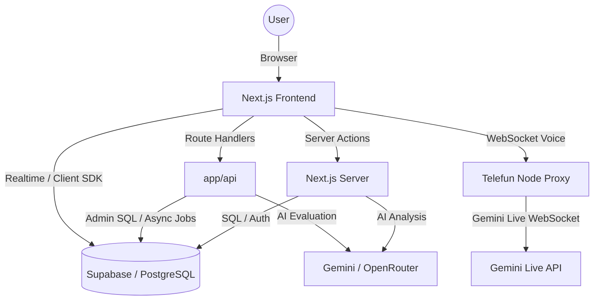

# System Architecture

Dokumen ini menjelaskan arsitektur teknis, tumpukan teknologi, dan struktur direktori proyek Trainers SuperApp.

## Tech Stack

Aplikasi ini dibangun menggunakan teknologi modern dengan fokus pada performa, keamanan, dan pengalaman pengembang.

- **Framework**: [Next.js 15](https://nextjs.org/) (App Router)
- **Library UI**: [React 19](https://react.dev/)
- **Bahasa**: [TypeScript](https://www.typescriptlang.org/)
- **Styling**: [Tailwind CSS 4](https://tailwindcss.com/)
- **Backend as a Service**: [Supabase](https://supabase.com/) (Auth, PostgreSQL, RLS, Storage)
- **Animasi**: [Framer Motion / Motion](https://www.framer.com/motion/)
- **Visualisasi Data**: [Recharts](https://recharts.org/)
- **Ikon**: [Lucide React](https://lucide.dev/)

## High-Level Architecture



### Penjelasan Alur:
1. **Frontend**: Menggunakan Next.js App Router dengan pemisahan Client dan Server Components.
2. **Server Actions**: Menjadi jalur default untuk mutasi data dan operasi server-side yang dipanggil langsung dari UI.
3. **Route Handlers**: Dipakai untuk flow server-only tertentu yang butuh endpoint eksplisit, misalnya evaluasi async PDKT di `app/api/pdkt/evaluate`.
4. **Supabase**: Menangani autentikasi user, penyimpanan data persisten, RLS, dan media Storage.
5. **RLS (Row Level Security)**: Memastikan keamanan data di tingkat database berdasarkan role user (Admin, Trainer, Leader, Agent).
6. **Telefun Proxy**: Flow voice real-time Telefun memakai service Node terpisah di `apps/telefun-server` untuk memvalidasi token Supabase lalu meneruskan audio ke Gemini Live API.
7. **AI Providers**: Modul simulasi dan beberapa flow laporan memakai provider abstraction server-side yang saat ini mendukung Gemini dan OpenRouter.

## Directory Structure

Struktur folder proyek mengikuti konvensi Next.js App Router:

```text
├── app/                  # Direktori utama Next.js
│   ├── (main)/           # Modul aplikasi (protected routes)
│   │   ├── dashboard/    # Unified Dashboard & User Management
│   │   ├── ketik/        # Simulasi Chat
│   │   ├── pdkt/         # Simulasi Email
│   │   ├── profiler/     # Database Peserta (KTP)
│   │   ├── qa-analyzer/  # SIDAK (QA Analytics)
│   │   └── telefun/      # Simulasi Telepon
│   ├── api/              # Route Handlers untuk flow server-only
│   ├── components/       # Shared UI Components (Card, Button, Sidebar, dll)
│   ├── lib/              # Core logic, services, hooks, & Supabase client
│   └── actions/          # Server Actions untuk mutasi data
├── apps/
│   └── telefun-server/   # Node WebSocket proxy untuk Gemini Live Telefun
├── scripts/              # Tooling operasional repo, termasuk backup Supabase
├── public/               # Asset statis (image, fonts, icons)
├── supabase/             # Konfigurasi Supabase & Migrasi SQL
├── docs/                 # Dokumentasi teknis sistem
└── local-backups/         # Artifact backup lokal, di-ignore dari git
```

## Data Flow Pattern

Proyek ini mengutamakan pola **Centralized Service Layer**:
- Logic database tidak diletakkan langsung di dalam komponen UI.
- Semua query kompleks berada di `app/lib/services/` (contoh: `qaService.server.ts`).
- Mutasi data default dilakukan melalui Server Actions di `app/actions/` atau folder modul terkait.
- Route Handlers tetap valid untuk workflow server-only yang membutuhkan boundary HTTP eksplisit, seperti async evaluation PDKT.
- Monitoring lintas akun dan usage billing menggunakan server/admin access via `createAdminClient()`, bukan direct browser read terhadap tabel sensitif.
- History simulasi KETIK/PDKT menggunakan tabel modul masing-masing sebagai sumber utama, sedangkan `results` masih dipakai untuk kompatibilitas monitoring dan histori legacy tertentu.

## AI Integration Pattern

- Integrasi AI dipusatkan di server action provider wrapper seperti `app/actions/gemini.ts` dan `app/actions/openrouter.ts`.
- Pemilihan model dan provider mengikuti canonical mapping di `app/lib/ai-models.ts`.
- Caller modul tidak boleh mengasumsikan bentuk response SDK/provider selalu stabil; ekstraksi `text` harus defensif dan siap menghadapi accessor, function, atau fallback dari `candidates[0].content.parts`.
- Output AI yang akan dipakai UI, sanitizer, atau parser JSON harus divalidasi terlebih dahulu agar perubahan SDK/provider tidak langsung memicu crash lintas modul.
- Usage AI dicatat server-side setelah request sukses final. Row gagal, timeout, 429 final, atau response tanpa metadata token tidak boleh menghasilkan usage log palsu.

## Environment & Runtime

Environment utama yang dipakai aplikasi:

- `NEXT_PUBLIC_SUPABASE_URL`
- `NEXT_PUBLIC_SUPABASE_ANON_KEY`
- `SUPABASE_SERVICE_ROLE_KEY`
- `GEMINI_API_KEY`
- `OPENROUTER_API_KEY`
- `NEXT_PUBLIC_APP_URL`
- `NEXT_PUBLIC_TELEFUN_WS_URL`

Environment khusus `apps/telefun-server`:

- `PORT`
- `SUPABASE_URL`
- `SUPABASE_ANON_KEY`
- `GEMINI_API_KEY`
- `ALLOWED_ORIGINS`

Repo ini belum menyediakan `.env.example`; buat `.env.local` secara manual. Wrapper Supabase tertentu memiliki placeholder agar build/dev helper tidak langsung crash saat public env kosong, tetapi runtime fitur auth/admin/AI tetap membutuhkan env yang benar.

## Commands & Verification

```bash
npm run dev
npm run lint
npm run type-check
npm run test:sidak
npm run build
npm run backup:supabase
npm run backup:supabase:storage
npm run backup:supabase:all
```

Catatan:

- `npm run type-check` adalah alias `next build`, sehingga lebih berat daripada TypeScript-only check dan juga menjalankan lint build.
- Build tidak menerapkan migration Supabase. SQL di `supabase/migrations/` tetap harus dipush atau dieksekusi ke target Supabase.
- Backup database memakai `pg_dump`; backup Storage harus dijalankan terpisah atau lewat `npm run backup:supabase:all`.
- Artifact backup berada di `local-backups/` dan tidak boleh masuk git.

## Security Model

Keamanan aplikasi dijaga di dua sisi:
1. **Middleware**: Memastikan hanya user terautentikasi yang bisa mengakses route `/(main)`.
2. **Server-side Guards**: Pengecekan role menggunakan helper di `app/lib/authz.ts`.
3. **Database RLS**: Filter data di tingkat PostgreSQL sehingga user hanya bisa melihat/mengubah data sesuai hak akses mereka.
4. **Admin Server Boundary**: Service role hanya dipakai di server action, server component, route handler, atau service server-side yang memang membutuhkan akses lintas akun.
