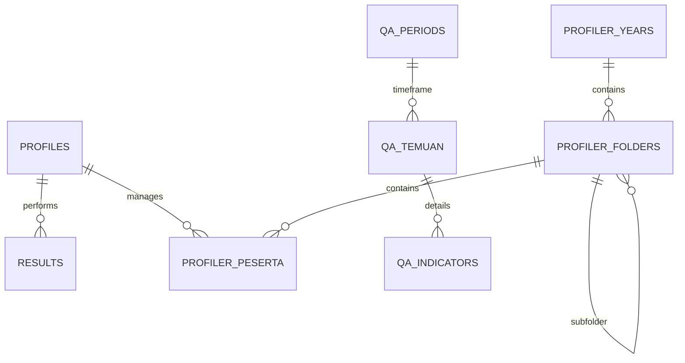

# Database Schema & Security

Dokumen ini menjelaskan struktur tabel PostgreSQL di Supabase dan kebijakan Row Level Security (RLS) yang diterapkan.

## ER Diagram (Overview)

## Tabel Utama

### 1. `public.profiles`
Menyimpan data profil user yang terintegrasi dengan `auth.users`.
- `id` (UUID, Primary Key): ID user dari Supabase Auth.
- `email` (Text, Unique): Email user.
- `full_name` (Text): Nama lengkap user.
- `role` (Text): Role user (`admin`, `trainer`, `leader`, `agent`).
- `status` (Text): Status akun (`pending`, `approved`, `rejected`).
- `created_at` (Timestamptz): Timestamp pendaftaran akun.
- `is_deleted` (Boolean): Flag untuk soft delete akun.

**Penting:** Tabel ini **TIDAK** memiliki kolom `avatar_url` atau `updated_at`. Seluruh kueri ke tabel ini wajib menggunakan konstanta `PROFILE_FIELDS` dari `app/lib/authz.ts` untuk mencegah *query failure* akibat kolom yang tidak ada.

### 2. `public.results`
Menyimpan hasil simulasi dari modul Ketik, PDKT, dan Telefun.
- `user_id` (UUID): Referensi ke `profiles`.
- `module` (Text): Nama modul.
- `score` (Integer): Skor hasil simulasi.
- `feedback` (Text): Saran perbaikan dari AI/System.
- `history` (JSONB): Log interaksi selama simulasi.

### 3. Modul Profiler (KTP)
- **`profiler_years`**: Daftar tahun database.
- **`profiler_folders`**: Batch atau grup peserta (mendukung struktur folder bertingkat).
- **`profiler_peserta`**: Data detail peserta (NIK, Alamat, Foto, dll).
- **`profiler_tim_list`**: Daftar tim operasional yang tersedia.

### 4. Modul SIDAK (QA Analyzer)
- **`qa_periods`**: Definisi periode audit kualitas.
- **`qa_temuan`**: Data utama audit (Agent, Tim, Temuan, Status).
- **`qa_indicators`**: Daftar parameter penilaian audit.
- **`qa_categories`**: Pengelompokan indikator temuan (Pareto mapping).

## Keamanan Data (RLS Policies)

RLS diaktifkan di seluruh tabel untuk memastikan isolasi data antar user.

| Tabel | Role: Agent | Role: Leader | Role: Trainer/Admin |
|---|---|---|---|
| `profiles` | Read (Own) | Read (All) | Read/Write (All) |
| `results` | Read/Write (Own) | Read (Team) | Read/Update (All) |
| `profiler_*` | No Access | Read (All) | Full CRUD Access |
| `qa_*` | Read (Own/Summary) | Read (Team) | Full CRUD Access |

### Fungsi Pembantu (Security Definer)
Sistem menggunakan fungsi `public.get_auth_role()` untuk mengambil role user saat ini secara efisien tanpa menyebabkan rekursi pada kebijakan RLS.

## Storage
Aplikasi menggunakan Supabase Storage bucket:
- `profiler-foto`: Menyimpan foto aset peserta (KTP/Profiler).
- `qa-reports`: (Opsional) Tempat penyimpanan dokumen laporan yang di-generate.
