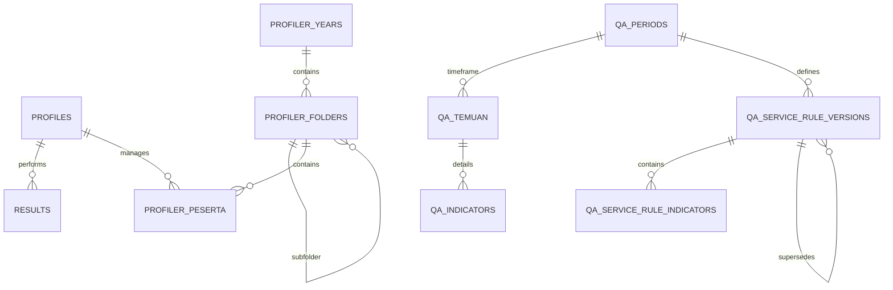

# Database Schema & Security

Dokumen ini menjelaskan struktur tabel PostgreSQL di Supabase dan kebijakan Row Level Security (RLS) yang diterapkan.

## ER Diagram (Overview)

## Tabel Utama

### 1. `public.profiles`
Menyimpan data profil user yang terintegrasi dengan `auth.users`.
- `id` (UUID, Primary Key): ID user dari Supabase Auth.
- `email` (Text, Unique): Email user.
- `full_name` (Text): Nama lengkap user.
- `role` (Text): Role user (`admin`, `trainer`, `leader`, `agent`).
- `status` (Text): Status akun (`pending`, `approved`, `rejected`).
- `created_at` (Timestamptz): Timestamp pendaftaran akun.
- `is_deleted` (Boolean): Flag untuk soft delete akun.

**Penting:** Tabel ini **TIDAK** memiliki kolom `avatar_url` atau `updated_at`. Gunakan konstanta `PROFILE_FIELDS` dari `app/lib/authz.ts` untuk canonical auth profile read. Untuk kueri feature-specific, pilih subset kolom yang memang diperlukan, tetapi tetap batasi hanya pada field yang benar-benar ada di skema ini agar tidak terjadi *query failure*.

### 2. `public.results`
Menyimpan hasil simulasi legacy/kompatibilitas dari modul Ketik dan Telefun, serta menjadi salah satu sumber monitoring histori lama.
- `user_id` (UUID): Referensi ke `profiles`.
- `module` (Text): Nama modul.
- `score` (Integer): Skor hasil simulasi.
- `feedback` (Text): Saran perbaikan dari AI/System.
- `history` (JSONB): Log interaksi selama simulasi.

**Catatan Saat Ini:** KETIK memakai `ketik_history` sebagai sumber utama riwayat sesi dan menulis `results.details.legacy_history_id` untuk kompatibilitas monitoring/delete mapping. Jika read `ketik_history` gagal di client (misalnya error transient/RLS mismatch), UI KETIK melakukan fallback read ke `results` modul `ketik` agar riwayat tetap bisa ditampilkan sambil menampilkan warning terstruktur di console. PDKT memakai `pdkt_history` sebagai sumber utama karena evaluasi berjalan async.

### 3. Modul Simulasi
- **`ketik_history`**: Riwayat sesi KETIK per user, termasuk skenario, identitas konsumen, dan messages.
- **`ketik_review_jobs`**: Antrean durable untuk proses review AI KETIK. Menyimpan status job (`queued`, `processing`, `completed`, `failed`), lease metadata (`lease_owner`, `lease_expires_at`), jumlah percobaan, dan pesan error terminal.
- **`pdkt_history`**: Riwayat sesi PDKT per user, email thread, config, waktu pengerjaan, dan hasil evaluasi async. Kolom `evaluation_status` mendukung state `processing`, `completed`, dan `failed`.
- **`pdkt_mailbox_items`**: Kotak masuk simulasi PDKT yang persisten. Menyimpan inbound email, snapshot skenario, status (`open`, `replied`, `deleted`), dan referensi ke `pdkt_history` setelah dibalas. Mendukung soft-deletion dan audit timestamps (`updated_at`, `replied_at`, `deleted_at`).

**Catatan Integritas PDKT Mailbox:**
- Fanout inbound email menggunakan RPC `submit_pdkt_mailbox_batch` dengan `SECURITY DEFINER`, `SET search_path = public`, validasi `auth.uid()`, dan role creator internal via `profiles`.
- Recipient fanout dibatasi ke akun aktif-approved (`status='approved'`, `is_deleted=false`) dengan role normalized `leader/agent`.
- Idempotensi memakai kombinasi unik `(created_by_user_id, client_request_id, user_id)`. Duplicate request mengembalikan source mailbox row milik creator (`user_id = created_by_user_id`, `is_shared_copy = false`) agar retry UI tidak menerima ID shared copy milik recipient.
- Eksekusi fungsi mailbox RPC direvoke dari `public, anon` dan hanya digrant ke role `authenticated`.
- **`telefun_history`**: Riwayat sesi TELEFUN per user, termasuk skenario, identitas konsumen, durasi, URL rekaman, skor, dan feedback. Row ini menjadi sumber utama histori Telefun; `results` tetap diisi untuk kompatibilitas monitoring lama melalui `details.legacy_history_id`.
- **`user_settings`**: Settings modul yang disimpan per user untuk KETIK, PDKT, dan TELEFUN. Modul tetap local-first di browser, lalu sync ke Supabase saat user login.

**Catatan Integritas KETIK Review:**
- `ketik_history.review_status='completed'` hanya dianggap valid jika row terkait tersedia di `ketik_session_reviews`.
- Jika polling menemukan `completed` tanpa row review, status di-auto-heal ke `failed` agar sesi dapat di-trigger ulang.
- `pending` berarti sesi belum dianalisis dan tombol "Mulai Analisis" harus tetap aktif; loading/spinner hanya dipakai untuk status `processing` atau request manual yang sedang berjalan.
- Siklus eksekusi review: manual trigger (`POST /api/ketik/review`) membuat/menyegarkan job durable lalu mencoba claim/process langsung via helper worker. `/api/ketik/worker` tetap tersedia sebagai fallback/background drain untuk job yang belum selesai atau lease yang kedaluwarsa, dan `/api/ketik/review/status` dipakai untuk polling serta auto-heal hasil yang tidak lengkap.
- Sebelum menulis hasil review secara destruktif (`DELETE + INSERT` review/typo rows), worker memperbarui lease dengan syarat `lease_owner` masih sama. Worker stale yang lease-nya sudah diambil worker lain harus berhenti tanpa menimpa hasil terbaru.

### 4. Modul Profiler (KTP)
- **`profiler_years`**: Daftar tahun database.
- **`profiler_folders`**: Batch atau grup peserta (mendukung struktur folder bertingkat).
- **`profiler_peserta`**: Data detail peserta (NIK, Alamat, Foto, dll).
- **`profiler_tim_list`**: Daftar tim operasional yang tersedia.

### 5. Modul SIDAK (QA Analyzer)
- **`qa_periods`**: Definisi periode audit kualitas.
- **`qa_temuan`**: Data utama audit (Agent, Tim, Temuan, Status). Non-phantom rows reject duplicate `(peserta_id, period_id, service_type, normalized no_tiket, indicator_id)` via `uq_qa_temuan_duplicate_input`; run `supabase/maintenance/qa_temuan_duplicate_input_cleanup.sql` to review historical duplicates before applying the index migration.
- **`qa_indicators`**: Daftar parameter penilaian audit (legacy, tetap digunakan untuk kompatibilitas).
- **`qa_categories`**: Pengelompokan indikator temuan (Pareto mapping).
- **`qa_service_rule_versions`**: Versi rule per service+periode dengan status `draft`, `published`, atau `superseded`. Dilengkapi kolom `version_number` (auto-increment per service+periode), `change_reason`, `created_from_version_id` untuk revision flow, serta `superseded_at`/`superseded_by`/`superseded_by_version_id` untuk audit trail saat versi digantikan. Unique constraint `uq_qa_rule_one_published_per_service_period` memastikan maksimal 1 published version aktif per service+periode.
- **`qa_service_rule_indicators`**: Snapshot indikator per rule version. Berisi `bobot`, `category`, `threshold`, `name`, dan `legacy_indicator_id` untuk backward compatibility. Kolom `updated_by` mencatat user terakhir yang memodifikasi.

### 6. Monitoring AI Usage & Billing
- **`ai_usage_logs`**: Log 1 baris per AI call sukses final. Menyimpan `request_id` unik, `user_id`, `provider`, `model_id`, `module`, `action`, token input/output/total, snapshot harga input/output per 1 juta token, snapshot kurs USD/IDR, serta estimasi biaya USD dan IDR.
- **`ai_pricing_settings`**: Harga token input/output per model kanonik. Lookup model mengikuti normalisasi `normalizeModelId()` agar alias lama tetap jatuh ke pricing yang benar.
- **`ai_billing_settings`**: Riwayat nilai kurs global USD ke IDR. Request baru memakai kurs terbaru saat request terjadi, sementara histori lama tetap memakai snapshot kurs yang sudah tersimpan di `ai_usage_logs`.

**Catatan Kontrak Billing:**
- Histori biaya tidak dihitung ulang dari setting terbaru. Snapshot harga dan kurs disimpan langsung pada row usage.
- **Kebijakan Backfill Terbatas**: Jika ditemukan data penggunaan pada **bulan berjalan** (WIB) yang bernilai `Rp0` padahal token positif, sistem mendukung koreksi harga/biaya secara retrospektif menggunakan pricing terbaru. Log lama di luar bulan berjalan tidak disentuh untuk menjaga audit trail.
- Request gagal, timeout, atau 429 final tidak boleh membuat row usage baru.
- Jika provider tidak mengembalikan metadata token atau pricing model belum tersedia, flow user tetap lanjut tetapi usage tidak dicatat.
- Akses monitoring lintas akun dilakukan server-side dengan `createAdminClient()`, bukan direct browser read.

## Keamanan Data (RLS Policies)

RLS diaktifkan di seluruh tabel untuk memastikan isolasi data antar user.

| Tabel | Role: Agent | Role: Leader | Role: Trainer/Admin |
|---|---|---|---|
| `profiles` | Read (Own) | Read (All) | Read/Write (All) |
| `results` | Read/Write (Own) | Read (Team) | Read/Update (All) |
| `profiler_*` | No Access | Read (All) | Full CRUD Access |
| `qa_*` | Read (Own/Summary) | Read (Team) | Full CRUD Access |

**Catatan Monitoring AI Usage:**
- `leader` hanya mendapatkan visibilitas usage monitoring dari server action yang sudah di-gate role.
- Editor pricing dan kurs hanya tersedia untuk `trainer` dan `admin`.
- Kontrak akses aplikasi untuk permukaan monitoring dijelaskan lebih detail di `docs/auth-rbac.md` dan `docs/MONITORING_TOKEN_USAGE_BILLING.md`.

### Fungsi Pembantu (Security Definer)
Sistem menggunakan fungsi `public.get_auth_role()` untuk mengambil role user saat ini secara efisien tanpa menyebabkan rekursi pada kebijakan RLS.

**`public.publish_rule_version(p_version_id, p_change_reason)`** — Atomic publish RPC untuk QA rule version. Menangani publish draft sekaligus supersede versi aktif sebelumnya dalam satu transaksi. Validasi wajib: tidak boleh ada indikator duplikat, bobot per kategori harus 100% (weighted mode), dan `change_reason` wajib diisi jika menggantikan versi published yang sudah ada. Hanya bisa dijalankan oleh role `admin`/`trainer`.

## Storage
Aplikasi menggunakan Supabase Storage bucket:
- `profiler-foto`: Menyimpan foto aset peserta (KTP/Profiler). Bucket ini public untuk read, sedangkan write dibatasi ke role `trainer`, `trainers`, dan `admin` melalui policy storage.
- `reports`: Menyimpan dokumen laporan AI SIDAK yang di-generate.
- `telefun-recordings`: Menyimpan rekaman Telefun jika fitur rekaman digunakan.

Backup database via `pg_dump` hanya mencakup schema/data PostgreSQL dan metadata storage. File fisik di bucket Storage harus dibackup terpisah melalui `npm run backup:supabase:storage`; lihat `docs/SUPABASE_LOCAL_BACKUP.md`. Untuk Profiler, object foto disimpan dengan path unik per upload agar URL public berubah saat foto diganti dan browser tidak tertahan cache lama. Untuk Telefun, backup yang lengkap berarti row `telefun_history` berada di dump database dan object audio di bucket `telefun-recordings` ikut masuk backup Storage bila rekaman sudah diunggah ke Supabase Storage.
