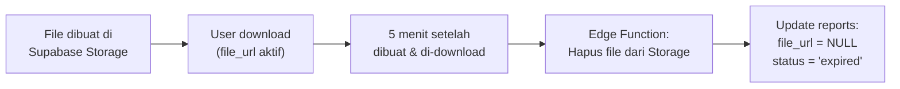
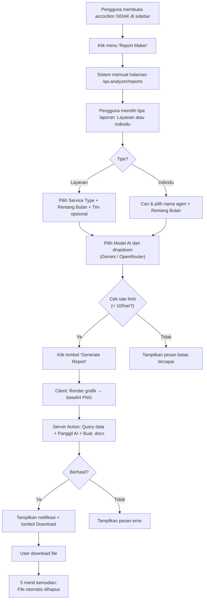
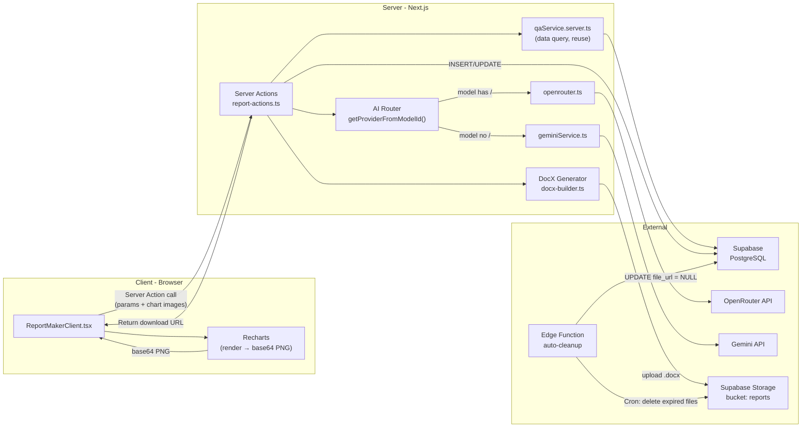
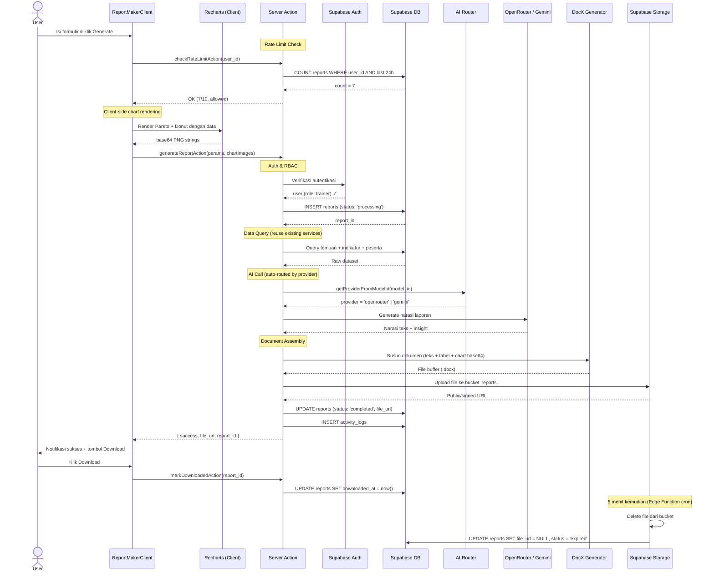

# Product Requirements Document (PRD) — Report Maker v1.1

> **Status**: Final Draft  
> **Modul Induk**: QA-Analyzer (SIDAK)  
> **Tanggal Revisi**: 11 April 2026

---

## Changelog Revisi dari PRD Asli

> [!IMPORTANT]
> Dokumen ini adalah **versi perbaikan** dari PRD asli. Semua isu telah dikoreksi berdasarkan analisis kode aktual proyek.

| # | Isu pada PRD Asli | Perbaikan |
|---|---|---|
| 1 | Menyebut Chart.js / ECharts sebagai library grafik | Proyek sudah menggunakan **Recharts v3.8** — harus konsisten |
| 2 | Menyebut endpoint REST API khusus untuk daftar model | Proyek ini menggunakan **Next.js Server Actions** — bukan REST endpoint |
| 3 | `AVAILABLE_AI_MODELS` di `.env` sebagai JSON string | Parsing JSON dari env rawan error. Gunakan **konfigurasi statis di kode** seperti `ai-models.ts` yang sudah ada, dengan flag env untuk enable/disable |
| 4 | Menyebut "Vercel Serverless Functions **atau** Node.js" | Proyek ini sudah pasti **Next.js App Router** dengan Server Actions |
| 5 | Skema DB `user_id: INT` | Supabase Auth menggunakan **UUID** — dikoreksi |
| 6 | Tidak ada tabel `reports` di DB saat ini | Perlu migration baru — didokumentasikan lengkap |
| 7 | Grafik oleh "Image Service" terpisah | Tidak realistis. Gunakan **client-side rendering → base64** lalu kirim ke server |
| 8 | Tidak ada kebutuhan non-fungsional | Ditambahkan (keamanan, performa, error handling, rate limiting) |
| 9 | Sequence diagram tanpa autentikasi & RBAC | Ditambahkan — konsisten dengan pola RBAC di setiap Server Action |
| 10 | Sidebar placement tidak presisi | Masuk ke accordion SIDAK yang sudah ada, di bawah "Ranking Agen" |
| 11 | Hanya mendukung OpenRouter | Arsitektur dibuat **model-agnostic** — mendukung Gemini, OpenRouter, dan model masa depan |

---

## 1. Overview

Fitur **Report Maker** adalah sub-menu baru di dalam modul SIDAK (QA-Analyzer) yang mengotomatisasi pembuatan laporan evaluasi kualitas dalam format dokumen Word (`.docx`).

Pada versi 1.1, pengguna dapat memilih **model AI dari berbagai provider** (Gemini, OpenRouter, dan model lain yang akan ditambahkan di masa depan). Daftar model dikelola melalui file konfigurasi di kode sumber ([ai-models.ts](file:///Users/nadindyta/Downloads/trainers-superapp-next/app/lib/ai-models.ts)), dengan kemampuan mengaktifkan/menonaktifkan model tertentu melalui variabel lingkungan. Pendekatan ini dipilih karena:

- Lebih aman dari kesalahan parsing JSON di environment variable.
- Konsisten dengan pola yang sudah ada di modul Ketik dan PDKT.
- Mendukung multi-provider (Gemini + OpenRouter) tanpa perubahan arsitektur.
- Fleksibel untuk penambahan model baru di masa depan.

---

## 2. Requirements

### 2.1 Fungsional

| ID | Kebutuhan | Prioritas |
|----|-----------|-----------|
| FR-01 | Sistem menarik data temuan dari tabel `qa_temuan` berdasarkan rentang bulan/tahun, termasuk relasi ke `qa_indicators` dan `profiler_peserta`. | **Wajib** |
| FR-02 | Sistem membaca daftar model AI dari konfigurasi statis (`ai-models.ts`), difilter berdasarkan flag environment, dan menampilkannya di dropdown. Daftar mendukung **semua provider** (Gemini, OpenRouter, dan model masa depan). | **Wajib** |
| FR-03 | Integrasi AI menggunakan Server Action yang sudah ada: `generateOpenRouterContent` untuk model OpenRouter, dan `generateGeminiContent` untuk model Gemini. Routing otomatis berdasarkan `getProviderFromModelId()`. | **Wajib** |
| FR-04 | Grafik Pareto dan Donut dirender di **client-side** menjadi base64 PNG, lalu dikirim ke server untuk disisipkan ke dokumen `.docx`. | **Wajib** |
| FR-05 | Output akhir berupa file `.docx` yang dihasilkan di server, disimpan di Supabase Storage bucket `reports`, dan dapat diunduh oleh pengguna. | **Wajib** |
| FR-06 | Menu Report Maker muncul di sidebar accordion SIDAK, di bawah "Ranking Agen". Hanya terlihat oleh role `trainer`/`trainers`. | **Wajib** |
| FR-07 | Setiap proses pembuatan laporan dicatat di tabel `reports` dan `activity_logs`. | **Wajib** |
| FR-08 | File laporan **otomatis dihapus 5 menit** setelah dibuat dan di-download. Record di tabel `reports` tetap tersimpan sebagai riwayat (dengan `file_url = NULL`). | **Wajib** |
| FR-09 | Rate limiting: maksimal **10 laporan per pengguna per hari**. | **Wajib** |
| FR-10 | Pengguna dapat melihat riwayat laporan yang pernah di-generate beserta statusnya. | Opsional (v1.2) |

### 2.2 Non-Fungsional

| ID | Kebutuhan | Detail |
|----|-----------|--------|
| NFR-01 | **RBAC**: Hanya role `trainer`, `trainers`, `admin`, `superadmin` yang boleh mengakses Report Maker. | Konsisten dengan pola RBAC di [actions.ts](file:///Users/nadindyta/Downloads/trainers-superapp-next/app/(main)/qa-analyzer/actions.ts) |
| NFR-02 | **Keamanan API Key**: `OPENROUTER_API_KEY` dan `GEMINI_API_KEY` tidak boleh terekspos ke klien. Semua pemanggilan AI harus melalui Server Action (`'use server'`). | Sudah diterapkan di kode eksisting |
| NFR-03 | **Timeout & Retry**: Proses generasi laporan maks 120 detik. Pemanggilan API AI menggunakan mekanisme retry yang sudah ada (4x dengan backoff untuk OpenRouter). | |
| NFR-04 | **Ukuran File**: File `.docx` keluaran tidak boleh melebihi 10MB. | |
| NFR-05 | **Error Handling**: Kegagalan di setiap tahap (query DB, AI, rendering grafik, pembuatan docx) harus menghasilkan pesan error yang informatif dan memperbarui status laporan ke `failed`. | |
| NFR-06 | **Responsif**: Antarmuka Report Maker harus berfungsi di perangkat desktop (≥1024px). Mobile adalah nice-to-have. | |
| NFR-07 | **Auto-Cleanup**: File laporan dihapus otomatis dari Supabase Storage 5 menit setelah dibuat dan di-download. Implementasi via scheduled task atau edge function. | |

---

## 3. Core Features

### 3.1 Pemilihan Model AI Multi-Provider

- **Dropdown pemilih model** pada UI formulir, dikelompokkan berdasarkan provider.
- Daftar model dibaca dari konfigurasi `ai-models.ts` yang sudah ada. Daftar dapat diperluas di file terpisah (`report-ai-models.ts`) atau menggunakan daftar yang sama.
- Setiap model menampilkan: **Nama**, **Deskripsi singkat**, dan **Badge provider** (Gemini / OpenRouter).
- Routing ke provider yang tepat dilakukan otomatis via `getProviderFromModelId()`:
  - Model ID mengandung `/` → OpenRouter → `generateOpenRouterContent()`
  - Model ID tanpa `/` → Gemini → `generateGeminiContent()`
- Model yang dipilih user disimpan bersama record laporan (`ai_model_used` + `ai_provider`).
- Penambahan model baru di masa depan cukup menambahkan entry di `ai-models.ts` — tidak perlu mengubah logika routing.

### 3.2 Laporan Berdasarkan Layanan (Service Report)

- Filter: **Tipe Layanan** (call, chat, email, cso, pencatatan, bko, slik) + **Rentang Bulan/Tahun**.
- Filter opsional: **Tim/Folder** (menggunakan data `profiler_folders` yang sudah ada).
- Konten laporan:
  - **Ringkasan Eksekutif**: Total temuan, rata-rata defect per audit, zero-error rate, compliance rate.
  - **Visualisasi Pareto**: Top parameter bermasalah (menggunakan data `ParetoData` yang sudah ada di dashboard).
  - **Visualisasi Donut Chart**: Distribusi Fatal vs Non-Fatal (menggunakan `CriticalVsNonCriticalData`).
  - **Tabel Detail**: Daftar temuan lengkap — kolom: No. Tiket, Nama Agen, Parameter, Nilai, Ketidaksesuaian, Rekomendasi.
  - **Narasi AI**: Analisis naratif yang dihasilkan AI berdasarkan data agregat.

### 3.3 Laporan Berdasarkan Individu (Individual Report)

- Pencarian agen menggunakan data dari `profiler_peserta`.
- Konten laporan:
  - **Profil Singkat Agen**: Nama, Tim, Batch, Jabatan.
  - **Ringkasan Performa**: Skor QA rata-rata, jumlah temuan, jumlah sesi.
  - **Tren Performa**: Grafik tren skor bulanan (menggunakan `getPersonalTrendAction`).
  - **Detail Temuan**: Tabel temuan per periode (menggunakan `getAgentTemuanAction`).
  - **Narasi AI**: Insight dan rekomendasi coaching berdasarkan pola temuan.

### 3.4 Auto-Cleanup File Laporan

File `.docx` yang di-generate bersifat **ephemeral** (sementara). Mekanisme cleanup:



**Implementasi**: Supabase Edge Function yang dipanggil via `pg_cron` atau scheduled invocation setiap 1 menit, memeriksa file yang sudah melewati batas waktu (5 menit setelah `created_at` DAN `downloaded_at IS NOT NULL`).

### 3.5 Rate Limiting

- Maksimal **10 laporan per pengguna per 24 jam**.
- Dihitung dari jumlah record di tabel `reports` dengan `user_id` dan `created_at >= now() - interval '24 hours'`.
- Jika melebihi batas, tampilkan pesan: _"Anda telah mencapai batas pembuatan laporan hari ini (10/10). Coba lagi besok."_
- Pengecekan dilakukan di Server Action sebelum memproses laporan.

---

## 4. User Flow



---

## 5. Architecture

> [!NOTE]
> Arsitektur ini dirancang **model-agnostic** — mendukung Gemini, OpenRouter, dan provider AI masa depan tanpa perubahan struktural.



### Komponen Utama

| Komponen | Tanggung Jawab | Lokasi |
|----------|----------------|--------|
| **ReportMakerClient.tsx** | UI formulir, pemilihan model, render grafik → base64, tampilan status & download | `app/(main)/qa-analyzer/reports/` |
| **report-actions.ts** | Server Actions: orchestrator utama — RBAC check, rate limit check, query data, panggil AI (multi-provider), buat dokumen, upload ke Storage | `app/(main)/qa-analyzer/reports/` |
| **qaService.server.ts** | Re-use query data yang sudah ada (temuan, indikator, tren, pareto, donut) | `app/(main)/qa-analyzer/services/` |
| **AI Router** | Otomatis routing ke provider berdasarkan model ID via `getProviderFromModelId()` | `app/lib/ai-models.ts` (sudah ada) |
| **openrouter.ts** | Panggilan API OpenRouter (sudah ada) | `app/actions/` |
| **geminiService.ts** | Panggilan API Gemini (sudah ada) | Sesuai lokasi eksisting |
| **docx-builder.ts** | Menyusun teks AI + tabel + gambar grafik (dari base64) menjadi file `.docx` | `app/(main)/qa-analyzer/reports/lib/` |
| **cleanup Edge Function** | Scheduled function: hapus file dari Storage setelah 5 menit + update DB | `supabase/functions/cleanup-reports/` |

---

## 6. Sequence Diagram



---

## 7. Database Schema

### 7.1 Tabel Baru: `reports`

| Kolom | Tipe | Constraint | Keterangan |
|-------|------|------------|------------|
| `id` | `UUID` | `PK, DEFAULT gen_random_uuid()` | |
| `user_id` | `UUID` | `FK → auth.users(id) ON DELETE SET NULL` | Pengguna yang men-generate |
| `report_type` | `TEXT` | `CHECK IN ('layanan', 'individu')` | Tipe laporan |
| `service_type` | `TEXT` | `NULL` | Hanya untuk report_type = 'layanan'. Nilai dari `ServiceType` |
| `peserta_id` | `UUID` | `FK → profiler_peserta(id) ON DELETE SET NULL` | Hanya untuk report_type = 'individu' |
| `parameters` | `JSONB` | `NOT NULL DEFAULT '{}'` | Filter: `{ year, startMonth, endMonth, folderIds }` |
| `ai_model_used` | `TEXT` | `NOT NULL` | ID model, misal: `'qwen/qwen3-next-80b-a3b-instruct:free'` |
| `ai_provider` | `TEXT` | `NOT NULL` | `'openrouter'` atau `'gemini'` |
| `status` | `TEXT` | `CHECK IN ('processing','completed','failed','expired')` | `DEFAULT 'processing'` |
| `error_message` | `TEXT` | `NULL` | Pesan error jika status = 'failed' |
| `file_url` | `TEXT` | `NULL` | URL file di Supabase Storage (NULL setelah expired) |
| `file_size_bytes` | `INT` | `NULL` | Ukuran file output |
| `processing_time_ms` | `INT` | `NULL` | Durasi pemrosesan (monitoring) |
| `downloaded_at` | `TIMESTAMPTZ` | `NULL` | Waktu user pertama kali download |
| `created_at` | `TIMESTAMPTZ` | `DEFAULT now()` | |

### 7.2 SQL Migration

```sql
-- Migration: create_reports_table
CREATE TABLE public.reports (
  id UUID PRIMARY KEY DEFAULT gen_random_uuid(),
  user_id UUID REFERENCES auth.users(id) ON DELETE SET NULL,
  report_type TEXT NOT NULL CHECK (report_type IN ('layanan', 'individu')),
  service_type TEXT,
  peserta_id UUID REFERENCES public.profiler_peserta(id) ON DELETE SET NULL,
  parameters JSONB NOT NULL DEFAULT '{}',
  ai_model_used TEXT NOT NULL,
  ai_provider TEXT NOT NULL DEFAULT 'openrouter',
  status TEXT NOT NULL DEFAULT 'processing'
    CHECK (status IN ('processing', 'completed', 'failed', 'expired')),
  error_message TEXT,
  file_url TEXT,
  file_size_bytes INT,
  processing_time_ms INT,
  downloaded_at TIMESTAMPTZ,
  created_at TIMESTAMPTZ NOT NULL DEFAULT now()
);

-- Indexes
CREATE INDEX idx_reports_user_id ON public.reports(user_id);
CREATE INDEX idx_reports_status ON public.reports(status);
CREATE INDEX idx_reports_created_at ON public.reports(created_at DESC);
CREATE INDEX idx_reports_cleanup ON public.reports(status, downloaded_at)
  WHERE status = 'completed' AND downloaded_at IS NOT NULL;

-- Enable RLS
ALTER TABLE public.reports ENABLE ROW LEVEL SECURITY;

-- RLS: Trainers can view all reports
CREATE POLICY "Trainers can view all reports" ON public.reports
  FOR SELECT USING (
    EXISTS (
      SELECT 1 FROM public.profiles
      WHERE profiles.id = auth.uid()
      AND profiles.role IN ('trainer', 'trainers', 'admin', 'superadmin')
    )
  );

-- RLS: Service role can manage reports (used by Server Actions)
CREATE POLICY "Service role can manage reports" ON public.reports
  FOR ALL USING (auth.role() = 'service_role');
```

### 7.3 Supabase Storage: Bucket `reports`

```sql
-- Migration: create_reports_storage_bucket
INSERT INTO storage.buckets (id, name, public, file_size_limit, allowed_mime_types)
VALUES (
  'reports',
  'reports',
  false,  -- Private bucket, requires signed URLs
  10485760,  -- 10MB limit
  ARRAY['application/vnd.openxmlformats-officedocument.wordprocessingml.document']
);

-- Storage Policy: Only authenticated trainers can read
CREATE POLICY "Trainers can download reports" ON storage.objects
  FOR SELECT USING (
    bucket_id = 'reports'
    AND EXISTS (
      SELECT 1 FROM public.profiles
      WHERE profiles.id = auth.uid()
      AND profiles.role IN ('trainer', 'trainers', 'admin', 'superadmin')
    )
  );

-- Storage Policy: Service role can upload/delete
CREATE POLICY "Service role manages report files" ON storage.objects
  FOR ALL USING (
    bucket_id = 'reports'
    AND auth.role() = 'service_role'
  );
```

### 7.4 Edge Function: Auto-Cleanup

```typescript
// supabase/functions/cleanup-reports/index.ts
// Di-trigger via pg_cron setiap 1 menit

import "jsr:@supabase/functions-js/edge-runtime.d.ts";
import { createClient } from "jsr:@supabase/supabase-js@2";

Deno.serve(async (req: Request) => {
  const supabase = createClient(
    Deno.env.get("SUPABASE_URL")!,
    Deno.env.get("SUPABASE_SERVICE_ROLE_KEY")!
  );

  // Cari file yang sudah di-download DAN sudah lewat 5 menit
  const { data: expiredReports } = await supabase
    .from("reports")
    .select("id, file_url")
    .eq("status", "completed")
    .not("downloaded_at", "is", null)
    .not("file_url", "is", null)
    .lt("downloaded_at", new Date(Date.now() - 5 * 60 * 1000).toISOString());

  if (!expiredReports?.length) {
    return new Response(JSON.stringify({ cleaned: 0 }));
  }

  let cleaned = 0;
  for (const report of expiredReports) {
    // Extract path from file_url
    const path = report.file_url.split("/reports/")[1];
    if (path) {
      await supabase.storage.from("reports").remove([path]);
    }
    await supabase
      .from("reports")
      .update({ file_url: null, status: "expired" })
      .eq("id", report.id);
    cleaned++;
  }

  return new Response(JSON.stringify({ cleaned }), {
    headers: { "Content-Type": "application/json" },
  });
});
```

> [!NOTE]
> **Scheduling**: Edge Function ini di-invoke via `pg_cron` extension atau Supabase Dashboard → Edge Functions → Schedule. Interval: setiap 1 menit.

---

## 8. Tech Stack

> [!IMPORTANT]
> Semua teknologi di bawah ini *harus konsisten* dengan stack yang sudah digunakan di proyek ini.

| Layer | Teknologi | Status |
|-------|-----------|--------|
| **Frontend** | Next.js (App Router) | ✅ Sudah ada |
| **UI Library** | Lucide Icons, Motion (Framer Motion) | ✅ Sudah ada |
| **Backend** | Next.js Server Actions (`'use server'`) | ✅ Sudah ada |
| **Database** | Supabase PostgreSQL | ✅ Sudah ada |
| **AI API — OpenRouter** | Via [openrouter.ts](file:///Users/nadindyta/Downloads/trainers-superapp-next/app/actions/openrouter.ts) | ✅ Sudah ada |
| **AI API — Gemini** | Via `generateGeminiContent` | ✅ Sudah ada |
| **AI Model Registry** | [ai-models.ts](file:///Users/nadindyta/Downloads/trainers-superapp-next/app/lib/ai-models.ts) + `getProviderFromModelId()` | ✅ Sudah ada |
| **Grafik (Client Preview)** | Recharts v3.8 → `toBase64Image()` via hidden canvas | ✅ Sudah ada |
| **Library Dokumen** | `docx` ([npmjs.com/package/docx](https://www.npmjs.com/package/docx)) | 🆕 Perlu install |
| **File Storage** | Supabase Storage — bucket `reports` (private) | 🆕 Perlu setup |
| **Auto-Cleanup** | Supabase Edge Function + `pg_cron` | 🆕 Perlu setup |

---

## 9. Konfigurasi Environment

### Variabel yang Sudah Ada (Cukup)

```env
# Digunakan oleh Report Maker — TIDAK perlu ditambah
OPENROUTER_API_KEY=sk-or-v1-xxxxx
GEMINI_API_KEY=AIzaSyXXXXX
NEXT_PUBLIC_SUPABASE_URL=https://xxx.supabase.co
SUPABASE_SERVICE_ROLE_KEY=eyJxxx
```

### Opsional: Flag Enable/Disable Model

```env
# Opsional — nonaktifkan model tertentu untuk Report Maker
REPORT_DISABLE_GEMINI_FLASH=false
REPORT_DISABLE_QWEN_80B=false
REPORT_MAX_PER_DAY=10
```

> [!TIP]
> Pendekatan ini lebih aman dibandingkan menyimpan JSON array di env karena:
> - Tidak ada risiko parse error.
> - Mudah di-toggle per environment (dev/staging/prod).
> - IDE dapat memberikan autocomplete dan validasi.
> - Penambahan model baru cukup tambah entry di `ai-models.ts` + opsional flag env.

---

## 10. Struktur File (Proposal)

```
app/(main)/qa-analyzer/reports/
├── page.tsx                        # Server Component — auth check + data fetching
├── ReportMakerClient.tsx           # Client Component — UI formulir + state + chart render
├── components/
│   ├── ReportForm.tsx              # Formulir input (tipe, service, tanggal, model)
│   ├── ReportHistory.tsx           # Tabel riwayat laporan (v1.2)
│   ├── ModelSelector.tsx           # Dropdown pemilih model AI (multi-provider)
│   └── ChartCapture.tsx            # Hidden Recharts → canvas → base64
├── lib/
│   ├── report-models.ts            # Konfigurasi model AI khusus Report (opsional)
│   └── docx-builder.ts             # Penyusun dokumen .docx dari teks + tabel + base64
└── actions/
    └── report-actions.ts           # Server Actions: generate, rate-limit, mark-download

supabase/functions/
└── cleanup-reports/
    └── index.ts                    # Edge Function: auto-delete expired files
```

---

## 11. Acceptance Criteria

### AC-01: Menu Sidebar
- [ ] Menu "Report Maker" muncul di accordion SIDAK, di bawah "Ranking Agen".
- [ ] Menu hanya terlihat oleh role `trainer`/`trainers`.
- [ ] Navigasi ke `/qa-analyzer/reports` berfungsi.

### AC-02: Formulir Generate
- [ ] Dropdown tipe laporan menampilkan "Layanan" dan "Individu".
- [ ] "Layanan" → dropdown service type + filter bulan/tahun + tim (opsional).
- [ ] "Individu" → search agen + filter bulan.
- [ ] Dropdown model AI menampilkan model dari semua provider (Gemini + OpenRouter) dengan badge provider.
- [ ] Tombol "Generate Report" disabled jika field wajib kosong.

### AC-03: Rate Limiting
- [ ] Jika user sudah generate ≥10 laporan dalam 24 jam, tombol Generate di-disable.
- [ ] Pesan informatif ditampilkan: _"Batas pembuatan laporan tercapai (10/10)."_
- [ ] Counter sisa kuota ditampilkan di UI.

### AC-04: Generasi Laporan
- [ ] Setelah klik Generate, tampilkan loading state dengan progress indicator.
- [ ] Grafik Pareto dan Donut dirender di client → base64 → dikirim ke server.
- [ ] AI dipanggil sesuai provider model yang dipilih (Gemini atau OpenRouter).
- [ ] Laporan berhasil: notifikasi sukses + tombol download.
- [ ] Laporan gagal: pesan error informatif.
- [ ] Record di tabel `reports` ter-update dengan status final.
- [ ] Record di `activity_logs` tercatat.

### AC-05: File Output
- [ ] File `.docx` berisi: header/judul, narasi AI, grafik (sebagai gambar), tabel data.
- [ ] File dapat dibuka dengan Microsoft Word dan Google Docs tanpa error.
- [ ] Ukuran file ≤ 10MB.

### AC-06: Auto-Cleanup
- [ ] Setelah user download, `downloaded_at` di-update.
- [ ] ~5 menit setelah download, file dihapus dari Supabase Storage.
- [ ] Status report berubah ke `expired`, `file_url` menjadi `NULL`.
- [ ] Record `reports` tetap tersimpan sebagai riwayat (tidak ikut terhapus).

### AC-07: Multi-Provider AI
- [ ] Model Gemini (misal: `gemini-3-flash-preview`) berhasil menghasilkan narasi.
- [ ] Model OpenRouter (misal: `qwen/qwen3-next-80b-a3b-instruct:free`) berhasil menghasilkan narasi.
- [ ] Penambahan model baru di `ai-models.ts` langsung muncul di dropdown tanpa perubahan kode lain.
